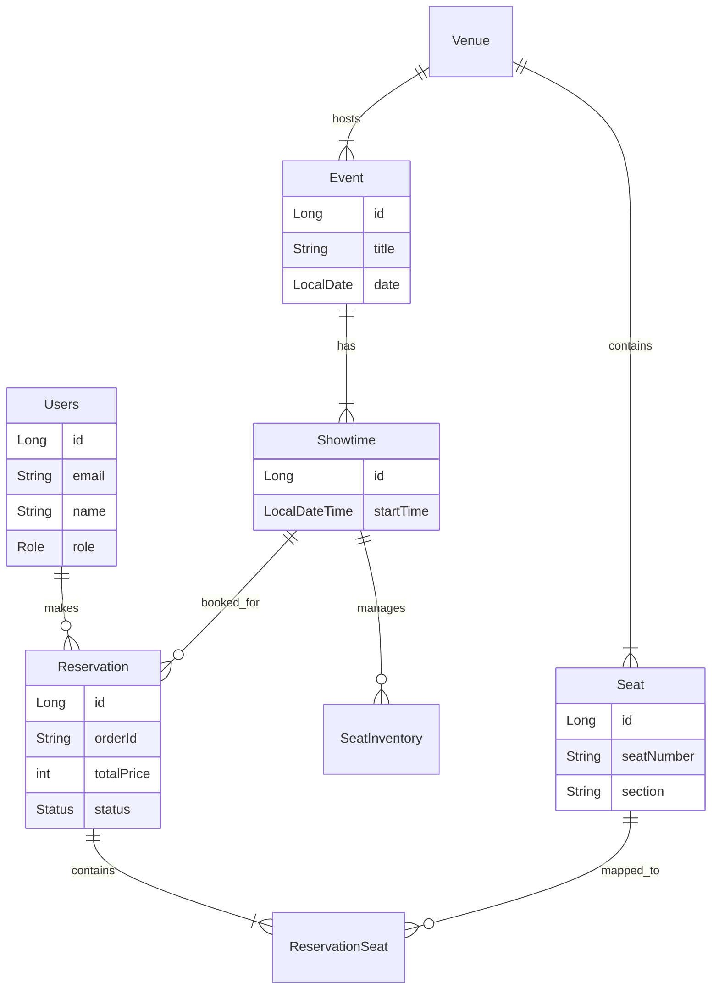

# Practice Shop

**Practice Shop**은 Spring Boot와 React를 기반으로 구축된 대규모 트래픽 처리를 위한 티켓팅 및 이커머스 실습 프로젝트입니다.
실제 서비스 환경을 모방하여 **대기열 시스템**, **실시간 좌석 선점**, **결제 시스템 연동** 등 고난이도 기능을 구현하였습니다.

---

## 🏗 아키텍처 (Architecture)

### 시스템 아키텍처
```mermaid
graph TD
    User[Client (Browser)] -->|HTTP/WebSocket| LB[Gateway / Load Balancer]
    LB -->|API Request| WebServer[Spring Boot Server]
    
    subgraph Service Layer
        WebServer -->|Auth| Security[Spring Security & JWT]
        WebServer -->|Logic| Service[Business Logic]
    end
    
    subgraph Data & Infra
        Service -->|Data| DB[(PostgreSQL)]
        Service -->|Queue & Cache| Redis[(Redis)]
        Service -->|Payment| Toss[Toss Payments API]
    end
```

---

## 🛠 기술 스택 (Tech Stack)

| Category | Technology | Description |
| --- | --- | --- |
| **Backend** | **Java 17** | 주요 언어 |
| | **Spring Boot 3.5.7** | 웹 프레임워크 |
| | **Spring Data JPA** | ORM (Hibernate) |
| | **Spring Security** | 인증/인가 (JWT, OAuth2) |
| | **Redis** | 대기열 관리, 캐싱 |
| | **PostgreSQL** | 메인 데이터베이스 |
| **Frontend** | **React 19** | UI 라이브러리 |
| | **Material UI v7** | UI 컴포넌트 |
| | **Zustand / Context** | 상태 관리 |
| | **SockJS & StompJS** | 실시간 통신 |
| **Infra** | **Docker** | 컨테이너화 |
| | **Docker Compose** | 멀티 컨테이너 오케스트레이션 |

---

## ✨ 주요 기능 (Key Features)

### 1. 사용자 인증 (Authentication)
- **JWT 기반 인증**: Access Token & Refresh Token 전략 사용.
- **OAuth2 소셜 로그인**: Google 로그인 지원.
- **보안**: Password 암호화, Role 기반 권한 제어 (USER, ADMIN).

### 2. 🚦 대기열 시스템 (Queue System)
트래픽 폭주로 인한 서버 다운을 방지하기 위해 **Redis 기반의 대기열 시스템**을 도입했습니다.
- **진입 제어**: API 요청 전 대기열 토큰 발급.
- **순차 처리**: `Active Queue`와 `Waiting Queue`를 분리하여 처리량 조절.
- **Poling**: 클라이언트에서 주기적으로 대기 순번 확인.

### 3. 예약 및 실시간 좌석 (Ticketing & Realtime Seats)
- **복잡한 예약 로직**: 공연 -> 회차 -> 구역 -> 좌석 선택 흐름.
- **실시간 동기화**: WebSocket(STOMP)을 이용하여 다른 유저가 좌석을 선택하면 **실시간으로 '선점됨' 상태 반영**.
- **동시성 제어**: 다수 유저가 동시 시도 시 데이터 무결성 보장 (DB Lock / Redis).

### 4. 결제 시스템 (Payment)
- **Toss Payments 연동**: 실제 결제 승인 및 취소 프로세스 구현.
- **트랜잭션 보장**: 결제 실패 또는 유저 취소 시 **자동 환불 및 좌석 점유 해제**.
- **멱등성**: 중복 결제 방지 로직.

### 5. 관리자 (Admin)
- **Batch Processing**: 수천 개의 좌석을 한 번에 생성하는 배치 기능.
- **CMS**: 공연장(Venue), 공연(Event), 회차(Showtime) 관리.

---

## 🗂 폴더 구조 (Project Structure)

핵심 비즈니스 로직이 위치한 `src` 디렉토리 구조입니다.

```text
src
├── main
│   ├── java
│   │   └── com.example.practice_shop
│   │       ├── config          # 설정 (Security, Swagger, WebSocket 등)
│   │       ├── constant        # Enums (Role, Status 등)
│   │       ├── controller      # API 엔드포인트
│   │       ├── dto             # 데이터 전송 객체
│   │       ├── entity          # DB 엔티티 (JPA)
│   │       ├── exception       # 전역 예외 처리
│   │       ├── repository      # DB 접근 계층
│   │       ├── service         # 비즈니스 로직
│   │       └── util            # 유틸리티 클래스
│   └── resources
│       ├── static              # 정적 리소스
│       ├── templates           # (Optional) SSR 템플릿
│       └── application.yml     # 설정 파일
└── test                        # JUnit & Mockito 테스트
```

---

## 💾 데이터베이스 설계 (ERD)

주요 엔티티 간의 관계도입니다.



---

## 🚀 시작하기 (Getting Started)

### 1. 환경 변수 설정 (.env)
프로젝트 루트에 `.env` 파일을 생성해주세요.

```properties
POSTGRES_USER=postgres
POSTGRES_PASSWORD=your_password
DB_URL=jdbc:postgresql://db:5432/shop
JWT_SECRET=your_secure_jwt_secret
GOOGLE_CLIENT_ID=your_client_id
GOOGLE_CLIENT_SECRET=your_client_secret
TOSS_SECRET_KEY=your_toss_payments_key
```

### 2. 실행 (Docker Compose)
가장 간편한 실행 방법입니다. DB, Redis, App을 모두 실행합니다.
```bash
docker-compose up -d --build
```

### 3. 로컬 실행 (Manual)
**Backend**
```bash
./gradlew bootRun
```
**Frontend**
```bash
cd practice-shop-frontend
npm install && npm start
```

---

## 📚 API 문서
서버 실행 후 아래 주소에서 Swagger 문서를 확인할 수 있습니다.
- **URL**: `http://localhost:8084/swagger-ui/index.html`
