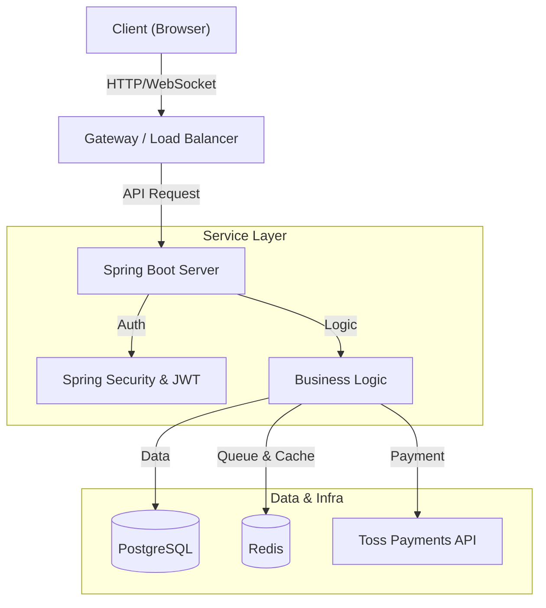

# Practice Shop

**Practice Shop**은 Spring Boot와 React를 기반으로 구축된 대규모 트래픽 처리를 위한 티켓팅 및 이커머스 실습 프로젝트입니다.
실제 서비스 환경을 모방하여 **대기열 시스템**, **실시간 좌석 선점**, **결제 시스템 연동** 등 고난이도 기능을 구현하였습니다.

---

## 🏗 아키텍처 (Architecture)

### 시스템 아키텍처


---

## 🛠 기술 스택 (Tech Stack)

| Category | Technology | Description |
| --- | --- | --- |
| **Backend** | **Java 17** | 주요 언어 |
| | **Spring Boot 3.5.7** | 웹 프레임워크 |
| | **Spring Data JPA** | ORM (Hibernate) |
| | **Spring Security** | 인증/인가 (JWT, OAuth2) |
| | **Redis** | 대기열 관리, 캐싱 |
| | **PostgreSQL** | 메인 데이터베이스 |
| **Frontend** | **React 19** | UI 라이브러리 |
| | **Material UI v7** | UI 컴포넌트 |
| | **Zustand / Context** | 상태 관리 |
| | **SockJS & StompJS** | 실시간 통신 |
| **Infra** | **Docker** | 컨테이너화 |
| | **Docker Compose** | 멀티 컨테이너 오케스트레이션 |

---

## ✨ 주요 기능 (Key Features)

### 1. 사용자 인증 (Authentication)
- **JWT 기반 인증**: Access Token & Refresh Token 전략 사용.
- **OAuth2 소셜 로그인**: Google 로그인 지원.
- **보안**: Password 암호화, Role 기반 권한 제어 (USER, ADMIN).

### 2. 🚦 대기열 시스템 (Queue System)
트래픽 폭주로 인한 서버 다운을 방지하기 위해 **Redis 기반의 대기열 시스템**을 도입했습니다.
- **진입 제어**: API 요청 전 대기열 토큰 발급.
- **순차 처리**:
    - `Active Queue`: 실제 트래픽을 처리하는 큐.
    - `Waiting Queue`: 대기 중인 유저 큐.
    - **Queue Worker**: `QueueWorker`가 주기적(2000ms)으로 `Waiting Queue`에서 일정 수량(Default 50)을 `Active Queue`로 승격시킵니다.
- **Poling**: 클라이언트에서 주기적으로 대기 순번 확인.

### 3. 예약 및 실시간 좌석 (Ticketing & Realtime Seats)
- **복잡한 예약 로직**: 공연 -> 회차 -> 구역 -> 좌석 선택 흐름.
- **실시간 동기화**: WebSocket(STOMP)을 이용하여 다른 유저가 좌석을 선택하면 **실시간으로 '선점됨' 상태 반영**.
- **동시성 제어**: 다수 유저가 동시 시도 시 데이터 무결성 보장 (DB Lock / Redis).

### 4. 결제 시스템 (Payment)
- **Toss Payments 연동**: 실제 결제 승인 및 취소 프로세스 구현.
- **트랜잭션 보장**: 결제 실패 또는 유저 취소 시 **자동 환불 및 좌석 점유 해제**.
- **멱등성**: 중복 결제 방지 로직.

### 5. 관리자 (Admin)
- **통합 마법사 (Wizard)**: 공연, 공연장, 회차를 한 번에 등록하는 올인원 페이지.
- **CMS**:
    - **공연 관리**: Event CRUD.
    - **공연장 관리**: Venue CRUD.
    - **회차 관리**: Showtime CRUD.
    - **좌석 관리**: 구역(Section) 및 좌석(Seat) 배치 관리.
    - **좌석 매퍼**: 시각적 좌석 배치 도구.
- **Batch Processing**: 대량의 좌석 데이터 일괄 생성 지원.

### 6. 검색 및 필터 (Search & Filter)
- **다양한 검색 조건**: 검색어(Keyword), 카테고리(Category)를 통한 정밀한 검색 지원.
- **필터링**: 공연 분류(콘서트, 스포츠 등) 및 날짜별 필터링 기능.

### 7. 리뷰 및 평점 (Reviews & Ratings)
- **별점 시스템**: 1~5점 척도의 직관적인 별점 기능.
- **생생한 후기**: 공연 관람 후 상세한 텍스트 후기 작성 가능.
- **작성 자격 검증**: 로그인한 사용자만 리뷰 작성 가능 (향후 예매 내역 연동 예정).

---

## 🗂 폴더 구조 (Project Structure)

핵심 비즈니스 로직이 위치한 `src` 디렉토리 구조입니다.

```text
src
├── main
│   ├── java
│   │   └── com.example.practice_shop
│   │       ├── config          # 설정 (Security, Swagger, WebSocket 등)
│   │       ├── constant        # Enums (Role, Status 등)
│   │       ├── controller      # API 엔드포인트
│   │       ├── dto             # 데이터 전송 객체
│   │       ├── entity          # DB 엔티티 (JPA)
│   │       ├── exception       # 전역 예외 처리
│   │       ├── repository      # DB 접근 계층
│   │       ├── service         # 비즈니스 로직
│   │       └── util            # 유틸리티 클래스
│   └── resources
│       ├── static              # 정적 리소스
│       ├── templates           # (Optional) SSR 템플릿
│       └── application.yml     # 설정 파일
└── test                        # JUnit & Mockito 테스트
```

---

## 💾 데이터베이스 설계 (ERD)

주요 엔티티 간의 관계도입니다.


---

## 🚀 시작하기 (Getting Started)

### 1. 환경 변수 설정 (.env)
프로젝트 루트에 `.env` 파일을 생성해주세요.

```properties
POSTGRES_USER=postgres
POSTGRES_PASSWORD=your_password
DB_URL=jdbc:postgresql://db:5432/shop
JWT_SECRET=your_secure_jwt_secret
GOOGLE_CLIENT_ID=your_client_id
GOOGLE_CLIENT_SECRET=your_client_secret
TOSS_SECRET_KEY=your_toss_payments_key
```

### 2. 실행 (Docker Compose)
가장 간편한 실행 방법입니다. DB, Redis, App을 모두 실행합니다.
```bash
docker-compose up -d --build
```

### 3. 로컬 실행 (Manual)
**Backend**
```bash
./gradlew bootRun
```
**Frontend**
```bash
cd practice-shop-frontend
npm install && npm start
```

### 4. 대기열 부하 테스트 (Load Testing)
대기열 시스템의 성능을 검증하기 위한 Python 스크립트가 제공됩니다.
```bash
# 가상환경 설정 및 실행 권장
python3 scripts/load_test_queue.py
```
- 다수의 쓰레드를 생성하여 대기열 진입 시나리오를 시뮬레이션합니다.
```

---

